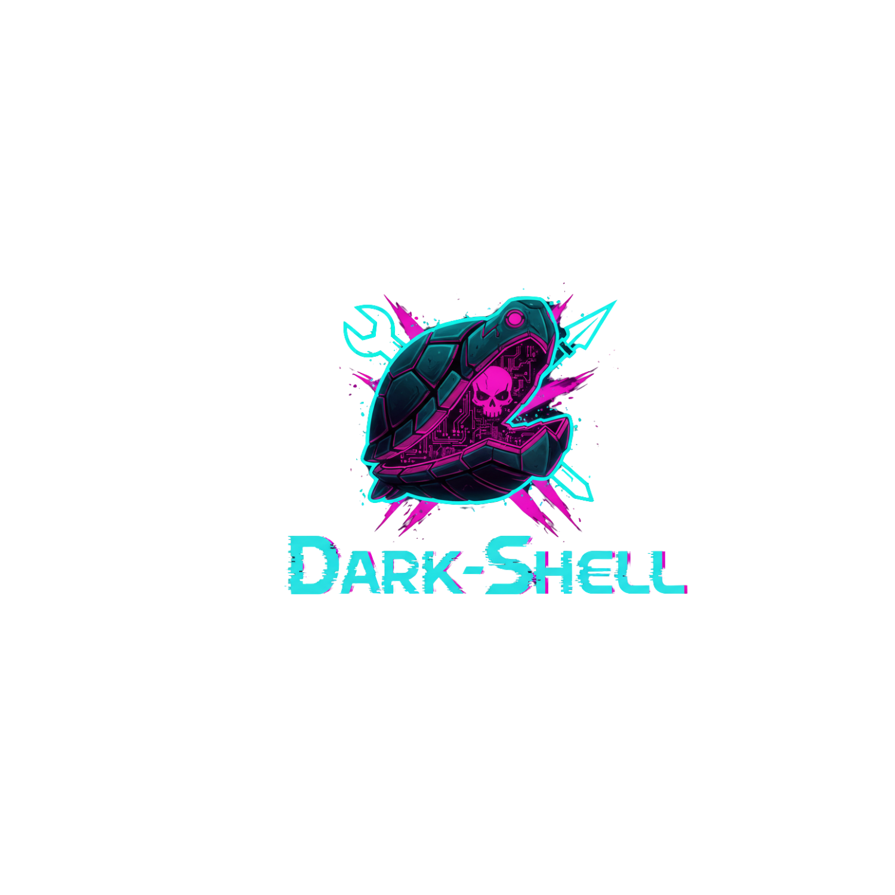

# Dark-Shell: V1
---
<p align="center">

</p>
"Dark-Shell" is a versatile and user-friendly penetration testing tool designed to simplify the process of generating Reverse Shells for ethical hacking and security testing purposes. With "Dark-Shell," users can effortlessly create customized Reverse Shells by providing essential parameters such as IP address, port number, output file name, and preferred programming language.
---

## 📌 Installation : 
  
  ```sh
  git clone https://github.com/0xPwn1/Dark-Shell
  cd Dark-Shell
  # Before Run 'install.sh' You Should be upldate Python3 and Pip 
  chmod +x install.sh && ./install.sh
```

## 📌 Usage :

```sh
    _____             _           _____ _          _ _ 
    |  __ \           | |         / ____| |        | | |
    | |  | | __ _ _ __| | _______| (___ | |__   ___| | |
    | |  | |/ _` | '__| |/ /______\___ \| '_ \ / _ \ | |
    | |__| | (_| | |  |   <       ____) | | | |  __/ | |
    |_____/ \__,_|_|  |_|\_\     |_____/|_| |_|\___|_|_|     

Drink Coffe, Enjoy Generate Shell                by HIJACKED - V1.2 

[INFO] Enter IP or Name-Interface: 192.168.43.234
[INFO] Enter Your PORT: 3795
[INFO] Enter Name File (Without Extension): shell


  ~) - Bash          ~) - Mfikto
  ~) - Perl          ~) - Perl-No-Sh
  ~) - Php           ~) - Rustcat
  ~) - Python        ~) - Netcat
  ~) - Powershell    ~) - Ruby
  ~) - Java          ~) - Groovy
  ~) - Awk           ~) - Nodejs
  ~) - Socat         ~) - Ncat


[INFO] Choose Your Language: awk


1)    Save to file
2)    Print to screen
3)    Copy to clipboard (pyperclip available)
4)    Create base64 one-liner (echo | base64 -d)


[INFO] Choose action (comma separated numbers allowed, e.g. 1,3): 2

--- GENERATED (SIMULATED) SHELL ---

echo '[SIMULATED] awk reverse shell to 192.168.43.234:3795'

--- END ---


! Done. If you want additional templates or features, tell me what to add.
```

